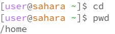

# `cd` command

**Example with no arguments**

I received no output when using the `cd` command with no arguments because it is basically changing the directory into nothing, therefore it is not changing the directory at all. This also means the current directory should be the same when running `pwd`.
