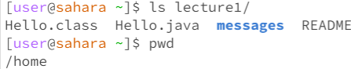
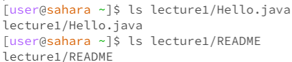
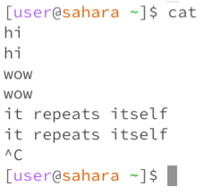
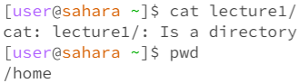
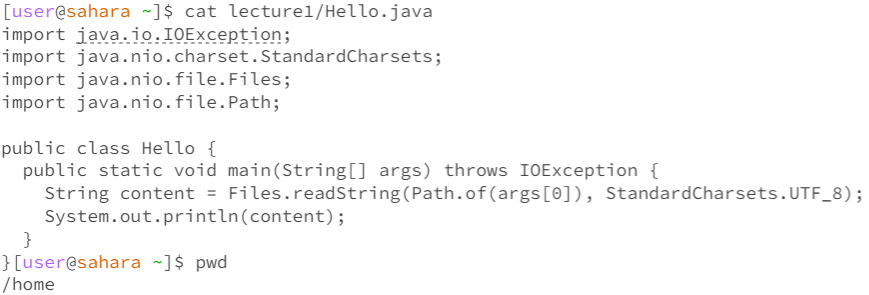

# **Lab Report 1**

## `cd` command  

**Example with no arguments**  
  
- The working directory is `~lecture1/messages~
- When I used `cd` with no arguments while in a directory, I get returned to the home directory which means `cd` with no argument changes directory to home. 
- The output is not an error because using `cd` with no arguments takes you home, so using `cd` in the home directory will do nothing, but using `cd` within another directory will change the directory to home. 

**Example with `cd` into a *directory***  
 
- The working directory is the home directory
- By using the `cd Lecture1/` command, my current working directory is changed to the Lecture1 folder which we can see with the `pwd` command.  
- The output is not an error since I meant to change the directory to the Lecture1 folder.

**Example with `cd` into a *file***  

- The working directory is `~/lecture1~
- By using the `cd README` command, an error was produced with the terminal telling us that `README` is not a directory, which is true because it is an `md` file.
- The output is an error since I tried to cd into something that was not a directory.

## `ls` command  

**Example with no arguments**  

- The working directory is the home directory
- The `ls` command, by itself, printed out the name of the `lecture1` directory when used from the home directory. The reason it printed this is because the `ls` command prints out the names of all the files and directories within the current working directory.
- This output is not an error since `ls` worked. 

**Example with `ls` into a *directory***  

- The working directory is the home directory
- Using `ls lecture1/` allowed us to see all the files and directories in the `lecture1` directory as it printed out those names in the terminal right after using the command. When we use the `ls` command with a directory as an argument, we can see all the contents in that directory.
- Since we want to see all the contents in a certian directory, the output was not an error.

**Example with `ls` into a *file***  

- The working directory is the home directory
- Using a file as an argument with `ls` provides us with the output of the location of the file. This can be useful if we want to know if a file exists.
- This output is not an error because since `ls` does not have the power to read files, it can only provide us with the location. 

## `cat` command  

**Example with no arguments**  

- The working directory is the home directory
- Using `cat` appears to "freeze" the terminal, but, in reality, it is taking input from the whatever the user types in the terminal and reads that input. It then outputs the same thing the user types.
- This output may seem like an error if you don't try inputting anything after entering `cat` but it is not an error since `cat` by itself is meant to react like that. 

**Example with `cat` and a *directory***  

- The working directory is the home directory
- When you use `cat` with a directory as an argument, the terminal will output that the directory you just inputed, which in our case is `lecture1` is a directory. The reason this could be is to imply for us to use `cat` with a file instead.
- This could be seen as an error since the `cat` command is meant to be used with files and not directory.

**Example with `cat` and  *file***  

- The working directory is the home directory
- When using `cat` with a file as the argument, the command acts as a reader for the file specified and prints all the text in that file.
- This output is not an error as `cat` is intended to read the text in a file. 
