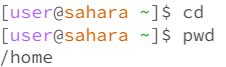
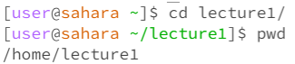
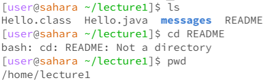
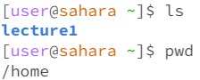

# **Lab Report 1**

## `cd` command  

**Example with no arguments**  
  
- I received no output when using the `cd` command with no arguments because it is basically changing the directory into nothing, therefore it is not changing the directory at all. This also means the current directory should be the same when running `pwd`. 
- The output is not an error because using `cd` with nothing is not supposed to change anything.

**Example with `cd` into a *directory***  
 
- By using the `cd Lecture1/` command, my current working directory is changed to the Lecture1 folder which we can see with the `pwd` command.  
- The output is not an error since I meant to change the directory to the Lecture1 folder.

**Example with `cd` into a *file***  

- By using the `cd README` command, an error was produced with the terminal telling us that `README` is not a directory, which is true because it is an `md` file.
- The output is an error since I tried to cd into something that was not a directory.

## `ls` command  

**Example with no arguments**  

- The `ls` command, by itself, printed out the name of the `Lecture1` directory when used from the home directory. The reason it printed this is because the `ls` command prints out the names of all the files and directories within the current working directory.
- This output is not an error since `ls` worked. 

