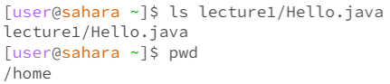

# **Lab Report 1**

## `cd` command  

**Example with no arguments**  
  
- I received no output when using the `cd` command with no arguments because it is basically changing the directory into nothing, therefore it is not changing the directory at all. This also means the current directory should be the same when running `pwd`. 
- The output is not an error because using `cd` with no arguments is not supposed to change anything.

**Example with `cd` into a *directory***  
 
- By using the `cd Lecture1/` command, my current working directory is changed to the Lecture1 folder which we can see with the `pwd` command.  
- The output is not an error since I meant to change the directory to the Lecture1 folder.

**Example with `cd` into a *file***  

- By using the `cd README` command, an error was produced with the terminal telling us that `README` is not a directory, which is true because it is an `md` file.
- The output is an error since I tried to cd into something that was not a directory.

## `ls` command  

**Example with no arguments**  

- The `ls` command, by itself, printed out the name of the `lecture1` directory when used from the home directory. The reason it printed this is because the `ls` command prints out the names of all the files and directories within the current working directory.
- This output is not an error since `ls` worked. 

**Example with `ls` into a *directory***  

- Using `ls lecture1/` allowed us to see all the files and directories in the `lecture1` directory as it printed out those names in the terminal right after using the command. When we use the `ls` command with a directory as an argument, we can see all the contents in that directory.
- Since we want to see all the contents in a certian directory, the output was not an error.

**Example with `ls` into a *file***  

- Using a file as an argument with `ls` provides us with the output of the location of the file. This can be useful if we want to know if a file exists.
- This output is not an error because since `ls` does not have the power to read files, it can only provide us with the location. 

## `cat` command  

**Example with no arguments**  

- Using `cat` by itself freezes the terminal and produces no output but it also doesn't allow us to type any more commands. This means we cannot use `cat` by itself with no arguments.
- This output is an error as it renders the terminal useless.

**Example with `cat` and a *directory***  

- When you use `cat` with a directory as an argument, the terminal will output that the directory you just inputed, which in our case is `lecture1` is a directory. The reason this could be is to imply for us to use `cat` with a file instead.
- This is not an error since the `cat` command is working properly.

** Example with `cat` and  *file***  

- When using `cat` with a file as the argument, the command acts as a reader for the file specified and prints all the text in that file.
- This output is not an error as `cat` is intended to read the text in a file. 
