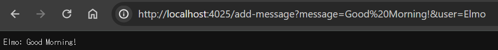
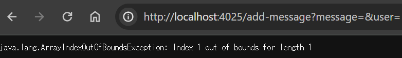
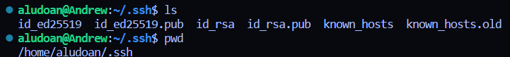
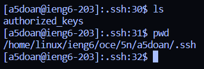
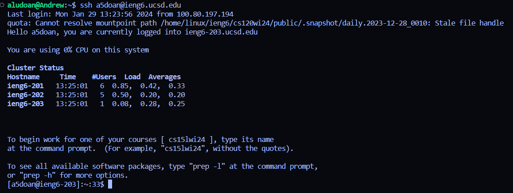

# **Lab Report 2**

## Part 1

```
import java.io.IOException;
import java.net.URI;

class Handler implements URLHandler {
    String messages = "";

    public String handleRequest(URI url) {
        if (url.getPath().equals("/add-message")) {
            String[] parameters = url.getQuery().split("&");

            String[] temp1 = parameters[0].split("=");
            String[] temp2 = parameters[1].split("=");

            String message = temp1[1];
            String user = temp2[1];

            messages += String.format("%s: %s" + "\n", user, message);
            return messages;
            }
        return messages;
    }
}

class ChatServer {
    public static void main(String[] args) throws IOException {
        if(args.length == 0){
            System.out.println("Missing port number! Try any number between 1024 to 49151");
            return;
        }

        int port = Integer.parseInt(args[0]);

        Server.start(port, new Handler());
    }
}
```
 <br/>
- The `handleRequest` method is called when using `/add-message?message=Good Morning!&user=Elmo`
- The arguments needed for the `handleRequest` method are `/add-message`, and the queries of `message=` and `user=` with the respective message and user after. The `handleRequest` method takes the queries and splits them into a local array `parameters` which is further split into two local arrays `temp1` and `temp2` so we end up with two arrays: one with `message` at its first index and the actual message at its second index. The other array has `user` at its first index and the actual user at its second index. We then add a formatted String that displays the message and user in the correct format to a String `messages` that is returned.
- In this case, we used `Good Morning!` for the message and `Elmo` for the user so `temp1[1]` will be `Good Morning!` and `temp2[1]` will be `Elmo`, resulting in the returned String of `Elmo: Good Morning!` 

 <br/>
- The `handleRequest` method is called when using `/add-message?message=&user=`
- The arguments needed for the `handleRequest` method are `/add-message`, and the queries of `message=` and `user=` with the respective message and user after. The `handleRequest` method takes the queries and splits them into a local array `parameters` which is further split into two local arrays `temp1` and `temp2` so we end up with two arrays: one with `message` at its first index and the actual message at its second index. The other array has `user` at its first index and the actual user at its second index. We then add a formatted String that displays the message and user in the correct format to a String `messages` that is returned.
- Since we left the arguments as blank in this case, there is no change in our relative fields as the code is not able to use an index on temp1 or temp2 since the second index is now empty. <br/>

## Part 2
 <br/>
 <br/>
 <br/>

## Part 3

Something that I learned this week that I did not know last week was how to make a generic messenger from code which was really cool since I can now think of ways to implement a better messenger. Also, using VS Code now makes me feel closer to being a developer compared to being in EdStem.
