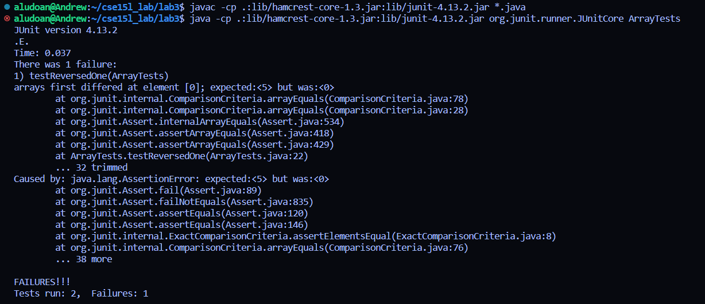
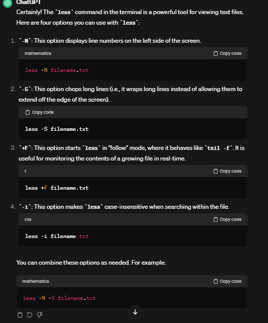

# **Lab Report 3**

## Part 1 <br/>

-The bug that I will choose from week 4 is from the `ArrayExamples.java`. 

```
@Test
  public void testReversedFail() {
    int[] input1 = {1, 2, 3, 4, 5};
    assertArrayEquals(new int[]{5, 4, 3, 2, 1}, ArrayExamples.reversed(input1));
  }
```
```
@Test
  public void testReversedNoFail() {
    int[] input1 = { };
    assertArrayEquals(new int[]{ }, ArrayExamples.reversed(input1));
  }
```
- In the first JUnit test case, I created an input array that had the values 1, 2, 3, 4, 5 and expected an array of 5, 4, 3, 2, 1 when calling the `reversed` method on the input array. This is meant to be the failure-inducing input
- In the second JUnit test case, I used an input array that had no values with an expected array being an array with no values as calling `reversed` on the input array will yield in itself. 


- Here we can see that the first JUnit failed, telling us that the expected, `5`, which was the first index of our expected array, was not what we received, `0`. This tells us that there is something wrong with the underlying method's code.
- The second JUnit test passed and seems to have passed since a reversed version of an array with no elements should be itself. 

Code before debugging: </br>
```
static int[] reversed(int[] arr) {
    int[] newArray = new int[arr.length];
    for(int i = 0; i < arr.length; i += 1) {
      arr[i] = newArray[arr.length - i - 1];
    }
    return arr;
  }
```
Code after debugging: </br>
```
static int[] reversed(int[] arr) {
    int[] newArray = new int[arr.length];
    for(int i = 0; i < arr.length; i += 1) {
      newArray[i] = arr[arr.length - i - 1];
    }
    return newArray;
  }
```

To fix the code, I changed the fourth line of the `reversed` method to `newArray[i] = arr[arr.length - i - 1];` and the reason this fixes the bug is because 
the original code set all the elements of the input array to 0 and then returned the original array, which gave us the symptom earlier of `0` instead of `5`.
In the new version of the code, the input array is not changed but the newArray's element is set to the input arrays last index and increments down to the element at the first index. We then return the newArray. </br>

## Part 2 </br>
First, I decided I wanted to use the `less` command to talk about and to find out what options I should use of `less`, I went to ChatGPT and asked `Hi, can you provide me with 4 options I could use with the less command in the terminal`. The AI's response was  </br>

So in this image, ChatGPT provides us with the `less` options of `-N`, `-S`, `+F`, and `-i`. </br>

For the `-N` option, I decided to use the `biomed` directory in `technical` and chose two files to use `less -N` on.


```
aludoan@Andrew:~/cse15l_lab$ less -N docsearch/technical/biomed/bcr583.txt
      1
      2
      3
      4
      5         Introduction
      6         The evidence that adolescent diet may affect the risk of
      7         breast cancer derives from several lines of evidence [ 1 ]
      8         . Rates of breast cancer among Asian immigrants to the
      9         United States do not approach those of US white women until
     10         the second or third generation, suggesting that exposures
     11         during childhood and adolescence are important in
     12         establishing a higher risk of breast cancer [ 2 3 ] .
     13         Norwegian women who were adolescents during World War II,
     14         when average caloric intake decreased by 22%, have a
     15         reduced incidence of breast cancer, suggesting that energy
     16         restriction might affect risk [ 4 ] . Similarly, in animal
     17         models, energy restriction in the peripubertal period
     18         inhibits mammary tissue proliferation and reduces the
     19         subsequent risk of mammary tumors [ 5 6 ] . Exposure of
     20         rats to carcinogens before first pregnancy increases the
     21         incidence of mammary tumors compared with exposure after
     22         first pregnancy [ 7 ] . After differentiation of the
     23         mammary gland at the time of first full-term pregnancy of
     24         the rat, the rate of cell division decreases and length of
     25         the cell cycle increases, allowing more time for DNA repair
     26         [ 8 ] . This biologic phenomenon might explain the apparent
     27         vulnerability of the adolescent breast tissue to
     28         carcinogenic exposures. Among atomic bomb survivors and
     29         women exposed to ionizing radiation as part of their
     30         treatment for Hodgkin's disease, the risk of breast cancer
```
```
aludoan@Andrew:~/cse15l_lab$ less -N docsearch/
docsearch/ is a directory
```
When using the `less -N` option on afile, `bcr583.txt`, less displays the contents of the file one page at a time, but with the `-N` option, we also get the line numbers on the side which can be useful for remembering which line a certan phrase was said. However, when we try to use the command on a directory, `docsearch` it just returns that `docsearch` is a directory and has similar behavior to `cat` which doesn't have very much of a use case. </br>

```


        Introduction
        The evidence that adolescent diet may affect the risk of
        breast cancer derives from several lines of evidence [ 1 ]
        . Rates of breast cancer among Asian immigrants to the
        United States do not approach those of US white women until
        the second or third generation, suggesting that exposures
        during childhood and adolescence are important in
        establishing a higher risk of breast cancer [ 2 3 ] .
        Norwegian women who were adolescents during World War II,
        when average caloric intake decreased by 22%, have a
        reduced incidence of breast cancer, suggesting that energy
        restriction might affect risk [ 4 ] . Similarly, in animal
        models, energy restriction in the peripubertal period
        inhibits mammary tissue proliferation and reduces the
        subsequent risk of mammary tumors [ 5 6 ] . Exposure of
        rats to carcinogens before first pregnancy increases the
        incidence of mammary tumors compared with exposure after
        first pregnancy [ 7 ] . After differentiation of the
        mammary gland at the time of first full-term pregnancy of
        the rat, the rate of cell division decreases and length of
        the cell cycle increases, allowing more time for DNA repair
        [ 8 ] . This biologic phenomenon might explain the apparent
        vulnerability of the adolescent breast tissue to
        carcinogenic exposures. Among atomic bomb survivors and
        women exposed to ionizing radiation as part of their
        treatment for Hodgkin's disease, the risk of breast cancer
```
```
aludoan@Andrew:~/cse15l_lab$ less -S docsearch/
docsearch/ is a directory
```

When using `less -S` on the same file, we receive the result similar to `less -N` but, this time, there are no line numbers. The ChatGPT response from earlier tells us that the `less -S` option wraps long lines when reading a file, which `less -N` may also do since they have similar formats so `less -S` is useful for easier readability of files. Using `less -S` on a directory gives us the same output as using `less -N` where it tells us that the directory we called the command on is a directory. We can see a pattern here. </br>

```
aludoan@Andrew:~/cse15l_lab$ less +F  docsearch/technical/biomed/bcr583.txt

        consumption of high-fat meats was associated with an
        increased risk of breast cancer, whereas increased
        consumption of fruits and vegetables was associated with a
        non-significant but consistent decrease in risk of breast
        cancer.


        Conclusion
        The present study revealed that increased consumption of
        eggs was associated with a decreased risk of breast cancer,
        whereas increased consumption of butter was associated with
        a slight increase in risk. In addition, increased intake of
        vegetable oils and dietary fiber seemed to be inversely
        related to risk of breast cancer. Future studies of the
        relation between adolescent diet and risk of breast cancer
        are warranted and should include a more complete assessment
        of diet.


        Competing interests
        None declared.


        Abbreviations
        BBD = benign breast disease; CI = confidence interval;
        FFQ = food-frequency questionnaire; Q = quintile; RR =
        relative risk.


Waiting for data... (interrupt to abort)
```
```
aludoan@Andrew:~/cse15l_lab$ less +F docsearch/
docsearch/ is a directory
```
When using `less +F` on the same file, the reader doesn't start at the top of the file this time but appears to read at the end. It also has a prompt at the bottom of the text telling us that it is waiting for data and according to the ChatGPT description from earlier, it seems like it is an option to read files that are being updated in real time. This can be very useful for server files, since they are usually updated in real time, as a reader. For using the command on a directory, as expected, it only tells us that the inputted directory is a directory. 

```


        Introduction
        The evidence that adolescent diet may affect the risk of
        breast cancer derives from several lines of evidence [ 1 ]
        . Rates of breast cancer among Asian immigrants to the
        United States do not approach those of US white women until
        the second or third generation, suggesting that exposures
        during childhood and adolescence are important in
        establishing a higher risk of breast cancer [ 2 3 ] .
        Norwegian women who were adolescents during World War II,
        when average caloric intake decreased by 22%, have a
        reduced incidence of breast cancer, suggesting that energy
        restriction might affect risk [ 4 ] . Similarly, in animal
        models, energy restriction in the peripubertal period
        inhibits mammary tissue proliferation and reduces the
        subsequent risk of mammary tumors [ 5 6 ] . Exposure of
        rats to carcinogens before first pregnancy increases the
        incidence of mammary tumors compared with exposure after
        first pregnancy [ 7 ] . After differentiation of the
        mammary gland at the time of first full-term pregnancy of
        the rat, the rate of cell division decreases and length of
        the cell cycle increases, allowing more time for DNA repair
        [ 8 ] . This biologic phenomenon might explain the apparent
        vulnerability of the adolescent breast tissue to
        carcinogenic exposures. Among atomic bomb survivors and
        women exposed to ionizing radiation as part of their
        treatment for Hodgkin's disease, the risk of breast cancer

/dna

        the cell cycle increases, allowing more time for DNA repair
        [ 8 ] . This biologic phenomenon might explain the apparent
        vulnerability of the adolescent breast tissue to
        carcinogenic exposures. Among atomic bomb survivors and
        women exposed to ionizing radiation as part of their
        treatment for Hodgkin's disease, the risk of breast cancer
        increases with younger age at exposure [ 9 ] .
        Although this analysis was principally an exploratory
        analysis to guide prospective studies, the authors had
        previously proposed that certain elements of adolescent
        diet might be protective against future risk of breast
        cancer [ 10 ] . For instance, we and others have proposed
        that fiber might be protective by lowering endogenous
        estrogen levels and that folate might be protective owing
        to its role in DNA methylation.


        Methods

          Study population
          This study was conducted among the participants of the
          Nurses' Health Study, a prospective cohort of 121,700
          women who have completed biennial questionnaires on
          medical events and lifestyle factors since the initiation
          of the study in 1976, when the women were 30-55 years of
          age [ 11 ] . The study has been approved by the
          institutional review board at the Brigham and Women's
          Hospital, Boston.


:
```
```
aludoan@Andrew:~/cse15l_lab$ less -i docsearch/
docsearch/ is a directory
```
When using the `less -i` option according to ChatGPT's description, we can search for words within the file without worrying about case sensitivity. So when I type `/dna` it brought me to the first instance of `DNA` in the text file. In the terminal, it also highlights the word. This is very useful when you want to jump to a specific part of a text file. When using the option on a directory, we also receive the same output as the previous three options. </br>

Although using `less` on a directory itself may not be useful, you could use the `find` command to list all the files within the directory to a new `txt` file and use `less` on that to read the files one page at a time. 
