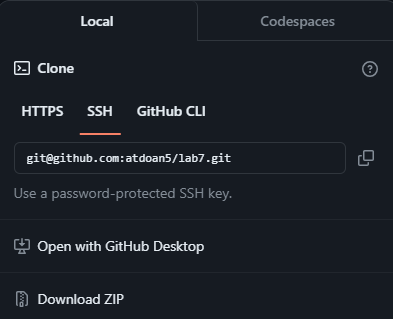
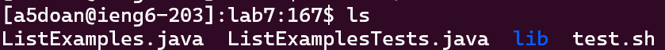
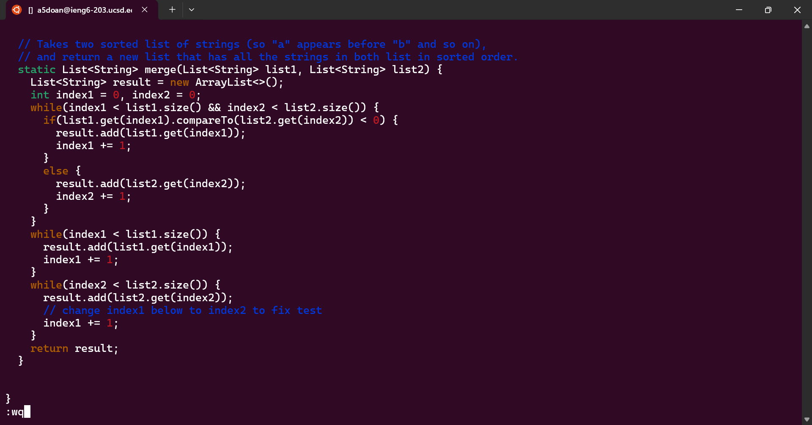

# **Lab Report 4**

## Step 4  

I open the terminal and type in the command `ssh<space>a5doan@ieng6.ucsd.edu<enter>` in order to connect to an `ieng6` machine on campus.  
  

The next thing I do is go to the fork of the repository from earlier on GitHub and copy the `SSH` link in order to clone in into my local repository later.  
  

## Step 5  
Next, I go back to my terminal and type `git<space>clone<space><Ctrl-V><enter>`.  
 

Next, once the clone has been completed, I will type in `cd<space>l<tab><enter>` to change my current directory into the new cloned directory. 
 

Then, I will use `ls<enter>` to check what files I have in my current working directory. 
 

## Step 6  
Next, I typed `bash<space>tesh.sh<enter>` to run the `java` test files. As you can see, the test fails.  
 

## Step 7  
Next, I typed `vim<space>List<tab>.<tab><enter>` in order to debug to `ListExamples.java` file. 
 
 

Now, I will type in `43j<enter>` in order to go down 42 lines, where I need to debug the code.  
 

Then, I will type `jjjjjjjjjjjxi1<esc>` to replace the `1` in `index1` to become a `2`, making it `index2 += 1` 
 

Finally, I will type `:wq<enter>` in order to save the changes I made to the file and exit the file. 
 

## Step 8  
Now, I will run the tests again to make sure my debugging worked by doing `bash<space>test.sh<enter>` like earlier. This time, the tests passed. 
 

## Step 9  
Then, I will type `git<space>add<space>L<tab>.<tab><enter>` in order to stage a change that is about to happen to a file, which, in this case, is `ListExamples.java` Doing this won't output
anything in the command line so I will use `git<space>commit<enter>` next in order to commit the changes to the fork of my `lab7` repository on GitHub. 
 

Now, I need to type a commit message in order to document my change to the file, so I will type `iFixed<space>bug<space>in<space>ListExamples.java<esc>`. `i` will enter insert mode and `esc` will exit it.  
 

Finally, I will escape the editor by typing `:wq<enter>` which also saves the edits. and type `git<space>push` in order to update the file on the GitHub repository. 

