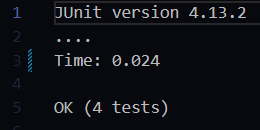
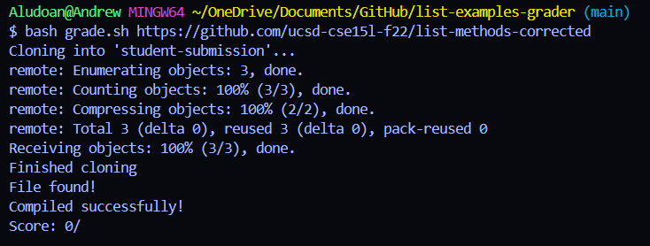
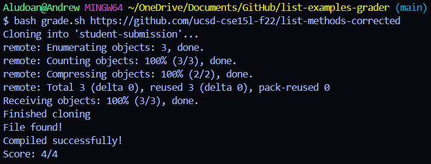

## **Lab Report 5**

## Student Post <br/>
Hi, <br/>
I'm working on the `grade.sh` script to grade sample student submissions but whenever I run my script, I can't seem to get the correct number of passed tests or the 
correct format. I'm not sure whether I'm putting the wrong syntax or I'm just completely doing it wrong. Can anybody help me? 
<br/>
Here is the output of the JUnit tests I ran and what I receive when I run the `grade.sh` file. <br/>
  <br/>

Here is the codeblock of `grade.sh` and I ran the command `bash grade.sh https://github.com/ucsd-cse15l-f22/list-methods-corrected` to receive the output above
```
CPATH='.;lib/hamcrest-core-1.3.jar;lib/junit-4.13.2.jar'

rm -rf student-submission
rm -rf grading-area

mkdir grading-area

git clone $1 student-submission
echo 'Finished cloning'


# Draw a picture/take notes on the directory structure that's set up after
# getting to this point

# Then, add here code to compile and run, and do any post-processing of the
# tests

if [ -f "student-submission/ListExamples.java" ]; then
    echo "File found!"
else 
    echo "ListExamples.java not found!"
    exit 1
fi

# jars
cp -r lib grading-area
# ListExamples
cp student-submission/ListExamples.java grading-area/
# TestListExamples
cp TestListExamples.java grading-area/

cd grading-area/
javac -cp $CPATH *.java

if [ $? -ne 0 ]; then
    echo "Compile error!"
    exit 1
else 
    echo "Compiled successfully!"
fi 

java -cp $CPATH org.junit.runner.JUnitCore TestListExamples > junit-output.txt


# Read the JUnit output from the file
junit_output=$(cat junit-output.txt)

if grep -q "OK (.* test)" <<< "$junit_output"; then
    num_tests=$(echo "$junit_output" | grep -o "OK ([0-9]* test)" | cut -d'(' -f2 | cut -d' ' -f1)
    num_passed_tests=$(echo "$junit_output" | grep -o "OK ([0-9]* test)" | cut -d'(' -f2 | cut -d' ' -f1)
    score="$num_passed_tests/$num_tests"
else
    # Count the number of tests and failures
    num_tests=$(echo "$junit_output" | grep -o "Tests run: [0-9]*" | cut -d' ' -f3)
    num_failures=$(echo "$junit_output" | grep -o "Failures: [0-9]*" | cut -d' ' -f2)

    # Calculate the score
    passed_tests=$((num_tests - num_failures))
    score="$passed_tests/$num_tests"
fi


# Output the score
echo "Score: $score"
```
## TA response <br/>
Hey! It looks like there's a spelling error in part of the code that calculates the passed score. Go through it again and make sure everything is spelled correctly.
I hope this helps! 


## Bug fix <br/>
The bug was within the last `if` statement in the `grade.sh` file where the student typed `test` instead of `tests` to `grep` from the output of the `JUnit` tests. By changing 
the spelling, the correct output is given, which is in the screenshot below. 
<br/>
 <br/>
The bug was clearly just a misspelling error that can ruin the whole purpose of the code, which is meant for grading student submissions (very important!). 
<br/>
<br/>
Also, this bug only appears if the student submission is supposed to <strong>pass</strong> as you can see if you read through the code block. If the student submission
fails, it should go through the else statement, which doesn't have a misspelling error.

## Setup <br/>
- To setup this scenario, you need to clone the GitHub repository from week6 anywhere on your computer.
- Then you need to copy the contents of the code block above and paste it into your `grade.sh` folder within the repository you just cloned. You also need to add a few
  tests to `TestListExamples.java` as there are more bugs than the current test can test which you can either develop yourself or use `ChatGPT` to create some tests if
  you want to test this scenario quicker. Depending on how many tests you have, your output may be different, e.g. having `0/5` tests instead of `0/4`. 
- You could then run the terminal command `bash grade.sh https://github.com/ucsd-cse15l-f22/list-methods-corrected`. By this point, you should
  see that the output in the `junit-output.txt` file that is created by the script should have different output than what the script's output printed in the terminal.
- To fix the bug, you simply need to go to the last `if` statement in the `grade.sh` file and change all the `test` to `tests`.
  Finally, if you run the script again with the same command as earlier, it should now have the correct output corresponding to the `junit-output.txt` file.

## Reflection <br/>
`JDB` was something that I learned in the second half of the quarter that I didn't know before. Whenever I would code in VSCode, I would also see a debugger option but never knew how to use it, so I assumed there were these debugging tools that could help us but I never bothered to learn. Once we were taught `JDB` in 15L, it was very 
intriguing to see another way to debug code other than just running them through JUnit tests or by changing certain things and printing over and over again. `JDB` can make
debugging much quicker by allowing us to see everything under the hood when a program fails. `Vim` was also something that was pretty cool. Although I don't think I will be using it as I personally think it's for people who are used to older devices without `Ctrl+F` or a visual interface, it was interesting to see why older people keep telling me to learn Vim. It simply makes you learn to move across the screen efficiently. 


